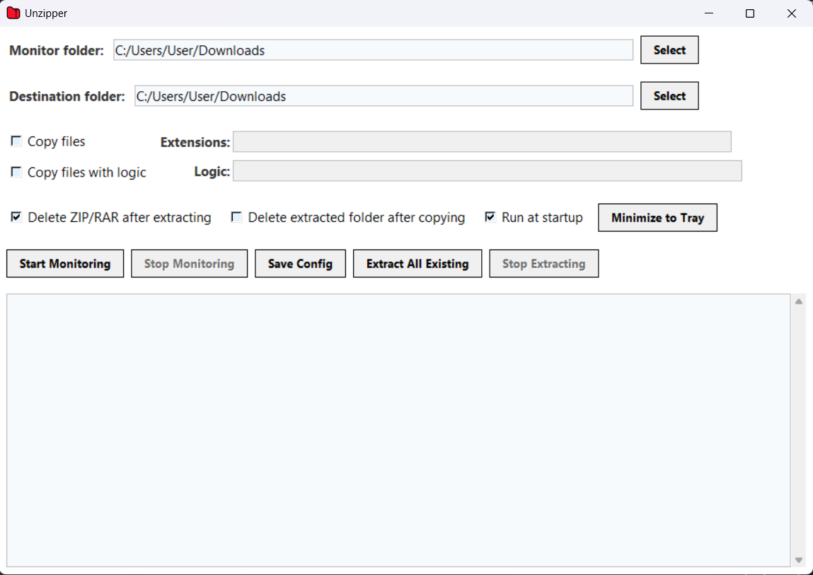

# Unzipper

Unzipper is an utility for automatically extracting ZIP and RAR files from a monitored folder, with advanced copy logic and much more.



## Features

- **Automatic Extraction**: Monitors a folder for new ZIP and RAR files and extracts them automatically.
- **Modern UI**: Clean, card-like interface with material-inspired, visually appealing checkboxes and consistent button/input styling.
- **Customizable Copying**:
  - Copy all files of selected extensions after extraction.
  - Advanced priority-based copy logic (e.g., copy only the highest-priority file types if present).
- **Immediate Stop Controls**: Extraction and copying can be halted instantly with a stop button.
- **Delete Options**:
  - Delete archive after extraction.
  - Delete extracted folder after copying.
- **Startup Option**: Option to run Unzipper automatically at Windows startup.
- **System Tray Support**: Minimize to tray with a custom icon; restore or exit from the tray menu.
- **Robust Error Handling**: Clear log output for all actions and errors.
- **Config Persistence**: Remembers all settings between sessions.

## Download

A pre-built Windows executable (EXE) is provided for convenience. You can use it directly without installing Python or any dependencies.

- Download the latest version from the [Releases](https://github.com/yourusername/unzipper/releases) section (or from this repository if provided).
- Simply unzip the file and double-click the EXE to run Unzipper on Windows.

## Building as an EXE

- Use [PyInstaller](https://pyinstaller.org/) to build:
  ```sh
  pyinstaller --onefile --windowed --icon=icon.ico unzipper.py
  ```
- Make sure `icon.ico` is in the same directory as `unzipper.py`.

## How to Use

1. **Select Folders**:
   - Set the folder to monitor for new archives.
   - Set the destination folder for extracted/copied files.

2. **Configure Copying**:
   - Enable "Copy files" and specify extensions (e.g., `jpg, png, ai`).
   - Or enable "Copy files with logic" and enter priority logic (e.g., `ai; png, esp; jpg`).

3. **Set Options**:
   - Choose whether to delete archives after extraction or delete extracted folders after copying.
   - Enable "Run at startup" if desired.

4. **Start Monitoring**:
   - Click **Start Monitoring** to begin watching the folder.
   - Use **Stop Monitoring** to pause.
   - Use **Extract All Existing** to process all current archives in the monitored folder.
   - Use **Stop Extracting** to halt extraction/copying immediately.

5. **Minimize to Tray**:
   - Click **Minimize to Tray** to hide the window and keep Unzipper running in the background.
   - Restore or exit via the tray icon menu.

6. **Logs**:
   - All actions and errors are shown in the log area at the bottom.

## Requirements
- Python 3.8+
- [PyInstaller](https://pyinstaller.org/)
- [pystray](https://pypi.org/project/pystray/)
- [Pillow](https://pypi.org/project/Pillow/)
- [watchdog](https://pypi.org/project/watchdog/)
- [rarfile](https://pypi.org/project/rarfile/) (optional, for RAR support)
- [pywin32](https://pypi.org/project/pywin32/) and [winshell](https://pypi.org/project/winshell/) (for startup shortcut)

Install all requirements with:
```sh
pip install -r requirements.txt
```

## Notes
- For RAR extraction, you must have `unrar.exe` available (see log for instructions if missing).
- All settings are saved in `unzipper_config.txt` in the app directory.
- The tray icon and taskbar icon are set from `icon.ico`.

---
